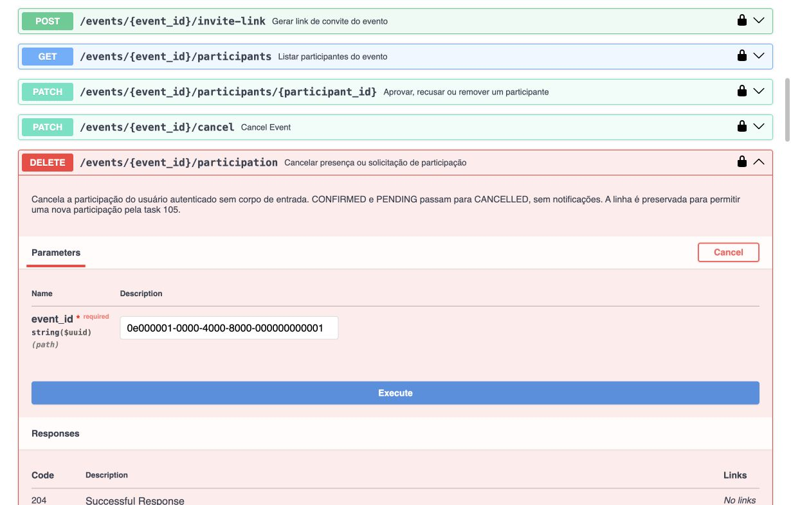
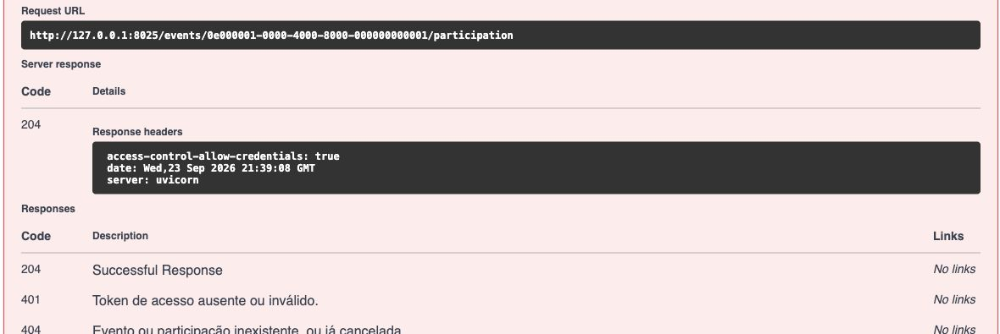
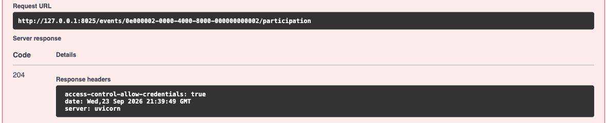
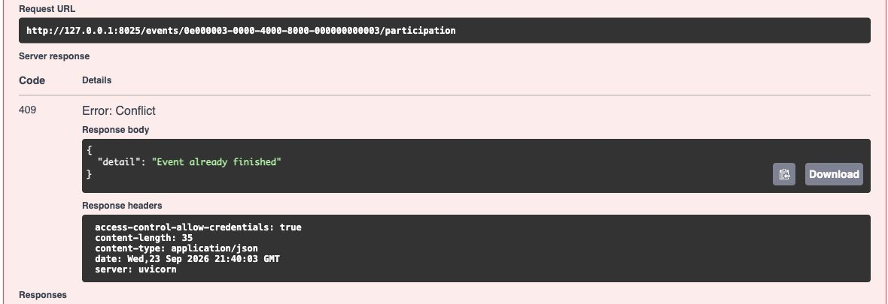
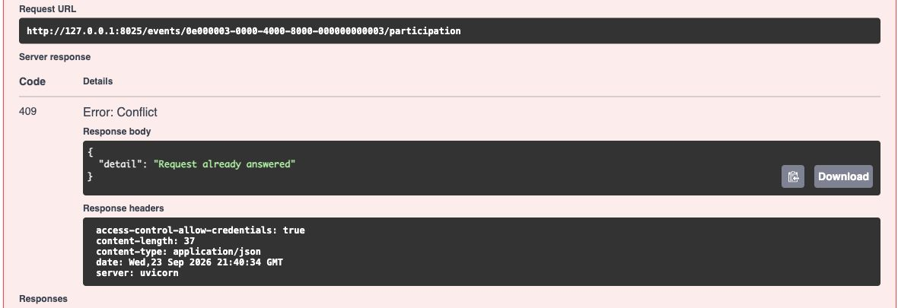

# Task 215 — cancelar participação

Task: https://app.clickup.com/t/90171450474/86e2zgdnw

Branch: `tid215/delete-events-participation`, baseada em `develop` (`800a025`).

## Contrato implementado

`DELETE /events/{event_id}/participation` usa o usuário autenticado e não recebe corpo.

| Estado atual | Resultado |
| --- | --- |
| CONFIRMED, evento não encerrado | CANCELLED, 204 sem corpo |
| PENDING | CANCELLED, 204 sem corpo |
| CONFIRMED, evento FINISHED ou ends_at já atingido | 409, `Event already finished` |
| REJECTED ou REMOVED | 409, `Request already answered` |
| Participação ausente ou CANCELLED; evento ausente ou excluído | 404, `Participant not found` |
| Token ausente ou inválido | 401 |

Preserva participant_id e joined_at; atualiza updated_at. Não cria notificação,
penalidade ou check-in. Bloqueia evento e depois participação na mesma transação,
na ordem utilizada pelas alterações do organizador e pela task 105.

### Interpretações da descrição consolidada

A decisão usa o status atual, conforme o objetivo da task. Uma solicitação já
aprovada está CONFIRMED e pode cancelar sua presença, inclusive em evento privado.
REJECTED e REMOVED retornam `Request already answered`. CANCELLED é tratado como
participação já ausente (404). O bloqueio por encerramento aplica-se à presença
CONFIRMED; uma solicitação PENDING pode ser retirada. Essas escolhas estão
explicitadas em testes, pois a descrição mistura termos das duas tasks antigas.
O detalhe 404 segue o contrato existente de participantes (`Participant not found`).

## Organização

Service, Protocol, repositório e rota próprios de cancelamento para evitar mudanças
nos arquivos em desenvolvimento na task 105. São exportados pelo mecanismo
existente `load_child_exports`, que gera `__all__` ordenado. Router registrado em
`app/main.py`. Sem novas dependências ou migrações.

## Validação em 23/09/2026

- Python 3.14.7; Ruff check e format aprovados.
- Suíte completa: **181 passed, 5 skipped**. Um skip preexistente, dois testes de
  locks exclusivos de PostgreSQL, dois de reentrada que dependem do POST da task 105.
- Task 215 em PostgreSQL 17 com migrações reais: **20 passed, 2 skipped** (os dois skips dependem do POST).
- Base atual + alterações da branch `tid105/post-events-participation` no SHA
  `3dda4192df2b558bc9f7201780866d3ed11669bb`: **22 passed** em PostgreSQL, incluindo
  cancelar e entrar/solicitar novamente com o mesmo participant_id. Essa composição
  foi feita apenas em uma cópia temporária; o código do POST não integra esta branch.
- Swagger local, dados fictícios, autenticação real e PostgreSQL: CONFIRMED → 204;
  PENDING em evento privado → 204; FINISHED → 409 `Event already finished`.
  Capturas salvas em `docs/evidence/task-215/`. Nova conexão confirmou CANCELLED,
  CANCELLED e CONFIRMED, respectivamente. Também foi validado o erro 409
  `Request already answered` após preparar a terceira participação como REJECTED.
- Inclui regressões para liberação da vaga, exclusão das listas, ausência de
  notificações, autorização, falha de persistência, cancelamentos simultâneos e
  decisão concorrente do organizador.

## Reproduzir

```sh
.venv/bin/ruff check .
.venv/bin/ruff format --check .
.venv/bin/pytest -q
```

Para PostgreSQL, forneça `TID215_TEST_DATABASE_URL` apontando exclusivamente para
um banco descartável e execute `pytest tests/test_cancel_participation.py -q`.
A fixture aplica migrações e limpa as tabelas após cada teste. Não use banco de
aplicação. Usa migrações porque o modelo preexistente de notificações gera
`DEFAULT false()` com create_all, incompatível com PostgreSQL; a migração real
utiliza `false`, corretamente. Este problema anterior não foi alterado pela task.

A reentrada depende da task 105 / PR #37:
https://github.com/AGES-Hangy/Hangy-Backend/pull/37
Os dois testes condicionais passam a rodar automaticamente quando o POST estiver
registrado na aplicação.

## Evidências visuais

Configuração da requisição autenticada, sem corpo:



Presença confirmada → 204:



Solicitação pendente em evento privado → 204:



Evento encerrado → 409:



Solicitação já respondida → 409:



As capturas das respostas foram enquadradas a partir da URL para não expor o
cabeçalho de autorização; a primeira captura mostra o método e os parâmetros.
Todos os dados são fictícios e as respostas vieram da API local com PostgreSQL.

